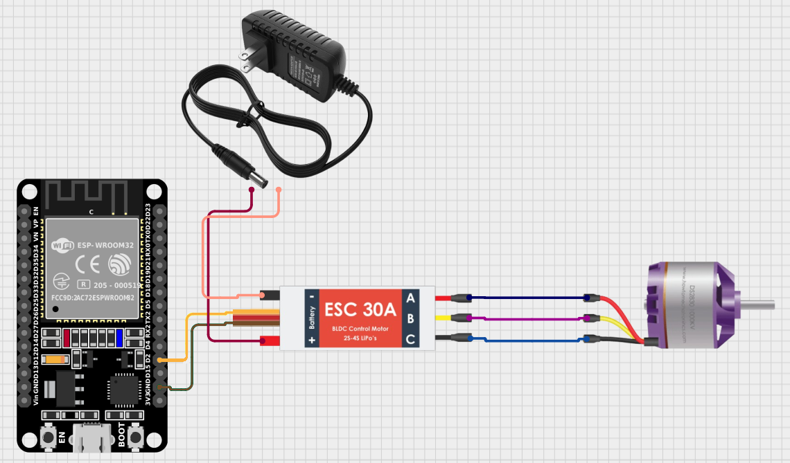

# ESP32 Brushless Motor ESC Calibration & Throttle Control

This project demonstrates how to calibrate, arm, and control a brushless motor Electronic Speed Controller (ESC) using an **ESP32** and the **ESP32Servo** library.  
The code performs an automatic calibration sequence (max → min throttle) and then allows you to control the motor throttle (0–100%) through the Serial Monitor.


---

## 🔧 Hardware Requirements

- **ESP32 Dev Module**  
  ⚠️ Make sure the Arduino IDE board selection is:  
  **Tools → Board → ESP32 Arduino → ESP32 Dev Module**
- Brushless motor (e.g., 2212, 2205, 1404, etc.)
- ESC (e.g., BLHeli, SimonK, HobbyWing)
- LiPo battery (3S/4S recommended)
- Jumper wires

> **Important:**  
> Never power the motor through USB. Always power the ESC using a proper LiPo battery.  
> ⚠ Remove propellers during testing.

---

## 🔌 Wiring (Connections)

| Component | ESP32 Pin |
|----------|-----------|
| ESC Signal Wire | GPIO 2 |
| ESC Ground | GND |
| ESC Power (Battery Input) | LiPo Battery |

If your ESC provides BEC output (5V), do **not** connect it to the ESP32's 5V pin.

---

## 📚 Required Library

Install the following library through Arduino IDE:

ESP32Servo (by Kevin Harrington)

Install via:

Arduino IDE → Tools → Manage Libraries → Search: "ESP32Servo"


---

## ▶️ How It Works

When you upload the code and open the Serial Monitor at **115200 baud**:

1. The ESP32 sends **2000 µs** (max throttle) for calibration.
2. After 3 seconds, it sends **1000 µs** (min throttle).
3. The ESC arms itself.
4. You can now enter any value between **0–100**.
5. The code converts your percentage into a PWM pulse (1000–2000 µs) and sends it to the ESC.

Example:


→ Sets motor throttle to ~30%.

---

## 🧩 Full Source Code

```cpp
#include <ESP32Servo.h>   // Make sure to install the library: ESP32Servo by Kevin Harrington

Servo esc;

void setup() {
  Serial.begin(115200);

  // Attach ESC signal to GPIO 2 with min/max pulse width (1000–2000 µs)
  esc.attach(2, 1000, 2000);

  Serial.println("Starting ESC Calibration & Arming...");

  // Step 1: Send maximum throttle (required by many ESCs for calibration)
  Serial.println("Sending MAX throttle (2000 µs)...");
  esc.writeMicroseconds(2000);
  delay(3000); // Wait 3 seconds

  // Step 2: Send minimum throttle to complete calibration
  Serial.println("Sending MIN throttle (1000 µs)...");
  esc.writeMicroseconds(1000);
  delay(3000); // Wait for ESC to arm

  Serial.println("ESC is ready! Send a value between 0–100 (throttle percentage).");
}

void loop() {
  if (Serial.available()) {

    // Read input from Serial as throttle percentage
    String input = Serial.readStringUntil('\n');
    int throttlePercent = input.toInt();

    // Clamp percentage between 0 and 100
    if (throttlePercent < 0) throttlePercent = 0;
    if (throttlePercent > 100) throttlePercent = 100;

    // Convert percentage (0–100%) to pulse width (1000–2000 µs)
    int pulseWidth = map(throttlePercent, 0, 100, 1000, 2000);

    // Send throttle pulse to ESC
    esc.writeMicroseconds(pulseWidth);

    Serial.print("Throttle set to: ");
    Serial.println(throttlePercent);
  }
}

```